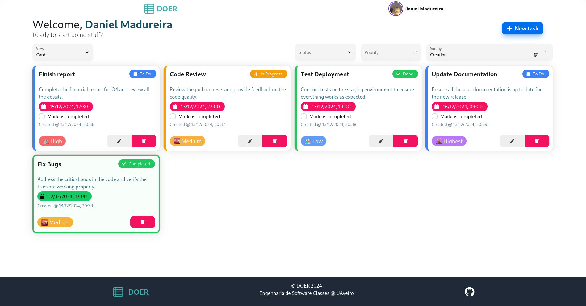
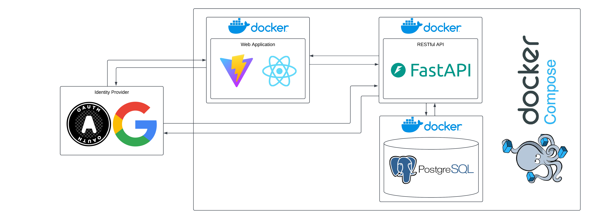
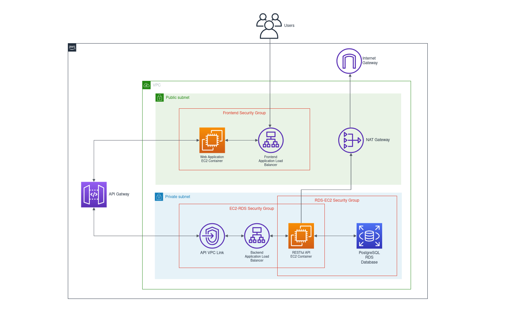

# DOER
Software Engineering individual assignment 2024/2025

 <!-- Replace # with the URL or path to your logo -->

## Description

Doer is a task management system designed to help users organize and manage their tasks efficiently. The system allows users to create, update, delete, and filter tasks through an intuitive web interface. It also supports different viewing options, such as gallery, list, and Kanban views, providing flexibility in how users interact with their tasks.

The application is built with a modern tech stack to ensure scalability, security, and performance. The frontend is developed using React with Vite for a responsive and user-friendly interface. Authentication is handled using Google OAuth for seamless and secure user login. The backend, powered by FastAPI, provides RESTful endpoints to interact with the PostgreSQL database for robust data storage and management.

---


---
### Key Features:

- Task organization with support for priorities, deadlines, and statuses.
- Backend-driven filtering and sorting for efficiency and scalability.
- A decoupled architecture that ensures maintainability and supports future expansion.
- High availability and fault tolerance through deployment in AWS infrastructure.
- The system focuses on providing a seamless user experience while leveraging backend capabilities to ensure consistency and security.

---

## Architecture



---
## Deployment



---

## Tutorial: See HTTPS deployed site

Follow these steps to add configurations to your hosts:

1. **Know which IPs were assigned to the Load Balancer**:
   - Run the command:
    ```bash
    host http://alb-doer-frontend-570455431.us-east-1.elb.amazonaws.com/
    # alb-doer-frontend-570455431.us-east-1.elb.amazonaws.com has address 35.173.103.123
    # alb-doer-frontend-570455431.us-east-1.elb.amazonaws.com has address 3.232.9.83
    ```
   
2. **Edit the hosts file**:
   - Open the `/etc/hosts` file using a text editor:
     ```bash
     sudo vim /etc/hosts
     ```

3. **Add the ips**:
   - Append the the lines (use the ips yougot in **1.**):
     ```bash
     35.173.103.123  es-ua.ddns.net
     3.232.9.83      es-ua.ddns.net
     ```

4. **Save Changes**:
   - Save the file and exit the editor (for `vim`, press `ESC`, then write`:wq`).

---

## Running the Application with Docker Compose

Follow these steps to set up and run the application using Docker Compose:

1. **Install Docker and Docker Compose**:
   - Download and install Docker and Docker Compose from the official [Docker website](https://www.docker.com/get-started).

2. **Start Docker**:
   - Ensure Docker is running on your system. On most systems, this happens automatically after installation. If not, start it manually:
     ```bash
     sudo systemctl start docker
     ```

3. **Run Docker Compose**:
   - Navigate to the directory containing your `docker-compose.yml` file and start the application:
     ```bash
     docker-compose up --build
     ```

4. **Stop Docker Compose**:
   - To stop the running containers, use:
     ```bash
     docker-compose down
     ```

---

## Links

- ### API docs: 
  - [https://jn1kiib3wl.execute-api.us-east-1.amazonaws.com/docs](https://jn1kiib3wl.execute-api.us-east-1.amazonaws.com/docs)
- ### Web App:
  - [https://es-ua.ddns.net/](https://es-ua.ddns.net/)
  - [http://alb-doer-frontend-570455431.us-east-1.elb.amazonaws.com/](http://alb-doer-frontend-570455431.us-east-1.elb.amazonaws.com/) - without **HTTPS** listener

---

## Contact

For questions or support, please reach out to us at [daniel.madureira@ua.pt](mailto:daniel.madureira@ua.pt).

